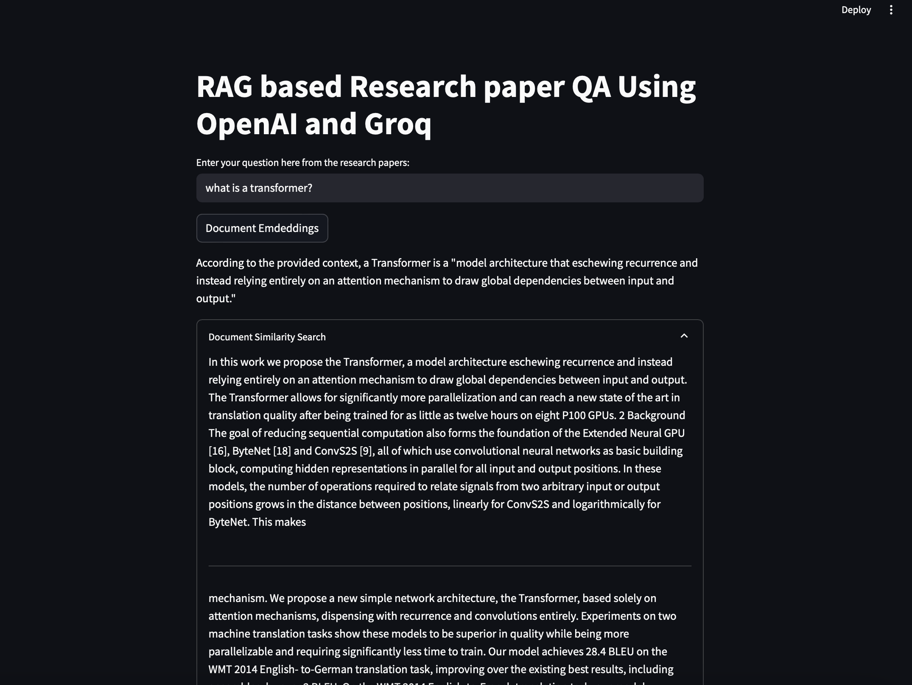

# RAG-based Research Paper QA System

A Retrieval-Augmented Generation (RAG) system that allows users to ask questions about research papers and receive AI-generated answers based on the content of those papers. This application uses Groq's Llama3-8b-8192 model for generating responses and OpenAI's embeddings for document retrieval.

## Features

- Interactive web interface built with Streamlit
- RAG architecture for accurate, context-aware responses
- PDF document processing and chunking
- Vector embeddings using OpenAI's embedding model
- FAISS vector store for efficient similarity search
- Groq's Llama3-8b-8192 model for response generation
- Document similarity search with expandable results

## Project Structure

```
RAG_QA_With_Groq/
├── app.py                 # Main application file
├── requirements.txt       # Project dependencies
├── .gitignore             # Git ignore file
└── research_papers/       # Directory containing PDF research papers
    ├── LLM.pdf            # Research paper on Large Language Models
    └── Attention.pdf      # Research paper on Attention Mechanisms
```

## Requirements

- Python 3.8+
- OpenAI API key
- Groq API key
- Research papers in PDF format

## Installation

1. Clone this repository:
   ```
   git clone <repository-url>
   cd RAG_QA_With_Groq
   ```

2. Install the required dependencies:
   ```
   pip install -r requirements.txt
   ```

3. Create a `.env` file in the project root with your API keys:
   ```
   OPENAI_API_KEY=your_openai_api_key
   GROQ_API_KEY=your_groq_api_key
   ```

4. Place your research papers in the `research_papers` directory

## Usage

1. Run the Streamlit application:
   ```
   streamlit run app.py
   ```

2. Open your web browser and navigate to the provided local URL (typically http://localhost:8501)

3. Click the "Document Embeddings" button to process the research papers and create vector embeddings

4. Enter your question about the research papers in the text input field

5. View the AI-generated response based on the content of the papers

6. Expand the "Document Similarity Search" section to see the relevant document chunks used to generate the response

## How It Works

1. **Document Processing**: The system loads PDF documents from the `research_papers` directory
2. **Text Splitting**: Documents are split into smaller chunks for processing
3. **Embedding Creation**: OpenAI's embedding model creates vector representations of the text chunks
4. **Vector Storage**: FAISS stores the embeddings for efficient retrieval
5. **Query Processing**: When a question is asked, the system:
   - Retrieves the most relevant document chunks
   - Passes them to the Groq LLM with the question
   - Generates a response based on the retrieved context

## Technologies Used

- **Streamlit**: Web application framework
- **LangChain**: Framework for building LLM applications
- **Groq**: High-performance LLM inference
- **OpenAI**: Embedding model for document vectors
- **FAISS**: Vector similarity search library
- **PyPDF**: PDF document processing
- **Python-dotenv**: Environment variable management

## Screenshots



